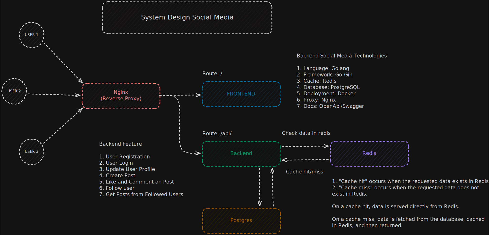
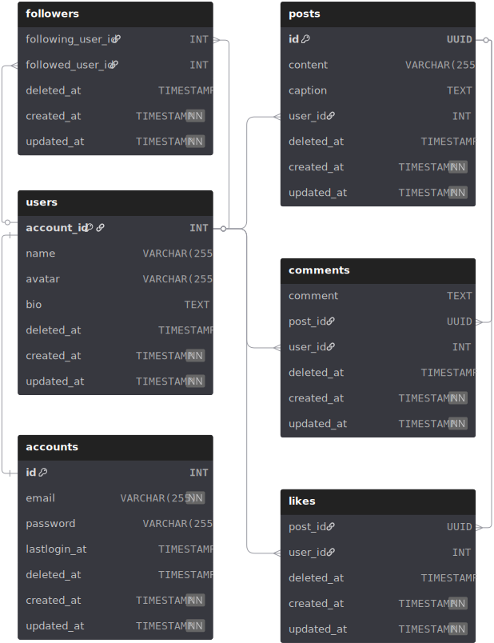

# Backend Social Media

Aplikasi **backend social media** yang menyediakan fitur autentikasi, manajemen user, posting konten, interaksi (like & comment), serta sistem follow antar user.  

---

## Architecture & Design

### System Design



### Entity Relationship Diagram (ERD)



---

## Project Structure

```sh
backend-social-media
├── cmd
├── config
├── db
│   ├── migration
│   └── seeder
├── docs
├── internal
│   ├── apperror
│   ├── cache
│   ├── config
│   ├── controller
│   ├── dto
│   ├── middleware
│   ├── model
│   ├── repository
│   ├── response
│   ├── router
│   └── service
├── pkg
│   ├── hash
│   └── jwt
├── docker-compose.yaml
├── Dockerfile
├── erd_social_media.svg
├── go.mod
├── go.sum
├── Makefile
├── README.md
└── system_design.svg
```
